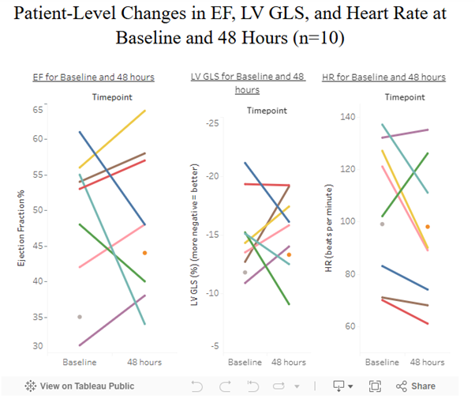

# 📊 Cardiac Dashboard – Tableau

Visualisation of patient-level changes in Ejection Fraction (EF), Left Ventricular Global Longitudinal Strain (LV GLS), and Heart Rate (HR) at baseline and after 48 hours (n = 10), using Tableau.

🔗 [View Interactive Dashboard on Tableau Public](https://public.tableau.com/app/profile/jacob.shardey/viz/LVGLSHRandEFvisualisationn10/Dashboard1?publish=yes)

---

### 🧪 Key Metrics Visualised:
- **Ejection Fraction (%):** Indicator of left ventricular function  
- **LV GLS (%):** More negative values suggest better contractility  
- **Heart Rate (bpm):** Changes in physiological response  

---

### 📘 Description:
Each line represents an individual patient’s change in metrics from baseline to 48 hours. The dashboard is designed for use in ICU cardiac monitoring research and is part of a larger study of echocardiographic strain in critical care patients.
